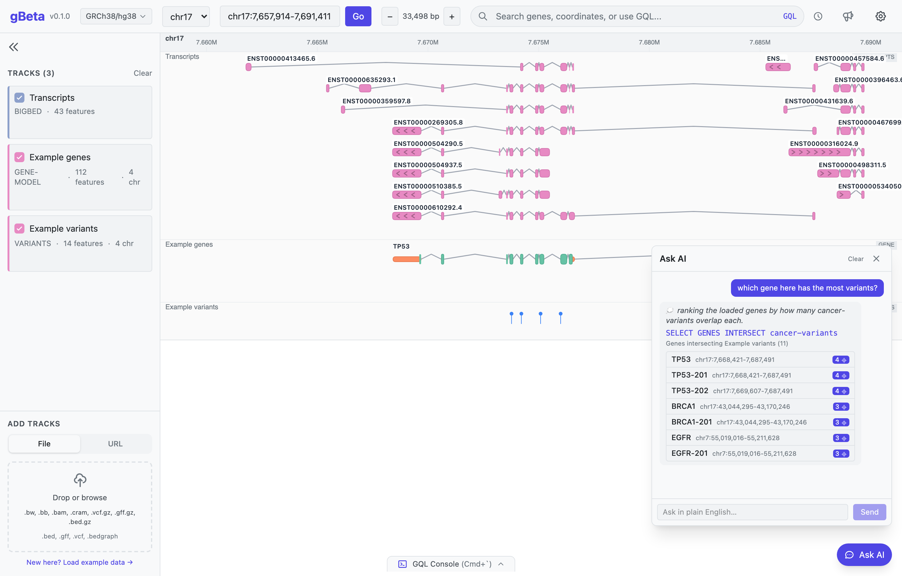

# gBeta: a private, web-native genome browser with a reproducible natural-language query interface

**Authors:** [Author list] — The Sainsbury Laboratory, University of East Anglia, Norwich, UK
**Correspondence:** [email]

> Draft software note for bioRxiv (short format). Warts-and-all: this describes
> gBeta as it currently stands, including its limitations. ~1,300 words + 1 figure.

---

## Abstract

Genome browsers are interactive viewers; richer interrogation of their data —
beyond gene and coordinate search — has generally been the province of separate,
often server-side tools and interfaces (for example the UCSC Table Browser,
Ensembl BioMart, or programmatic REST and scripting access). Separately, language
models make it tempting to *ask* questions of genomic data in plain English, but a
free-text answer from an opaque model is hard to record, audit, or reproduce. We
present **gBeta**, a lightweight, zero-install genome browser that integrates a
small, readable query language (GQL) and a natural-language interface directly
into the interactive browser, operating on the user's own data entirely
client-side. Plain-English
questions are translated by a pluggable language model into a concrete GQL
command that the user can read, edit, save, and re-run — so the convenience of
natural language is retained without sacrificing reproducibility. All file
parsing is client-side; data never leaves the user's machine. gBeta supports the
common interval, signal, variant and alignment formats (local and remote),
resolves gene symbols against public services, and provides filtering, overlap
and aggregation queries over loaded tracks. gBeta is open source (MIT) and usable
immediately at
https://teammaclean.github.io/gbeta/.

## Introduction

Interactive genome browsers — IGV [1], the UCSC Genome Browser [2] and JBrowse 2
[3] among them — are central to genomics, and they are far from query-incapable.
All support navigation and search by gene or coordinate, and richer interrogation
is available through associated tools: the UCSC Table Browser [7] and Data
Integrator filter, intersect and export tracks, Ensembl BioMart [8] answers
complex attribute queries, and REST APIs and scripting interfaces (e.g. IGV batch
commands, igv.js [9], JBrowse plugins) provide programmatic access. These capabilities are powerful but
typically sit *outside* the interactive view — in a separate page or interface, a
programming environment, or a query against server-hosted reference data — so
asking an ad hoc question of one's *own* loaded data, within the browser, still
commonly means inspecting by eye or exporting to another tool.

Separately, large language models have made it attractive to *ask* such questions
in plain English. The difficulty for science is reproducibility: a free-text
question answered by an opaque model is hard to record, audit or re-run, and the
answer cannot easily be checked.

gBeta addresses both points together, and its contribution is one of
*integration* rather than of any single capability. The browser exposes a small,
human-readable query language (GQL) over the tracks the user has loaded;
natural-language questions are translated *into* GQL rather than answered
directly, and the translation is always surfaced as an editable command before it
runs. The user therefore gets the ergonomics of asking a question and the
reproducibility of a concrete script, applied to their own data inside the
interactive view rather than in a separate tool. A second design commitment is
privacy: gBeta is a static web application with no backend, so genomic data is
parsed and held only in the browser, and language-model calls transmit only the
question and a small description of the loaded tracks — never the data itself.

## Implementation and features

gBeta is a client-side application (Svelte 5 / SvelteKit, TypeScript; track
rendering on HTML Canvas) deployed as static files, with no server component. It
loads the common genomics formats both from local files (drag-and-drop) and from
remote URLs via HTTP range requests: BED, GFF3, bedGraph and VCF, the indexed
binary formats BigBed, BigWig, BAM and CRAM, and block-gzipped tabix files;
alignment and signal parsing use the GMOD JavaScript libraries [4]. Roughly two
dozen reference assemblies are built in with reference sequence, and chromosome
naming is reconciled to the active assembly on load. Gene symbols are resolved to
coordinates against MyGene.info [5] and the Ensembl REST API [6], so navigation
by gene name works for arbitrary genes rather than a fixed list.

**The query language (GQL).** GQL covers navigation (`NAVIGATE`, `ZOOM`, `PAN`)
and data queries over the loaded tracks. `SELECT GENES|VARIANTS|FEATURES` accepts
`FROM` (a named track), `WHERE` (field predicates, including any VCF INFO field),
`INTERSECT` and `WITHIN` (overlap with another track or a gene/region), an `IN`
scope (the current view, chromosome, or an explicit region), and `ORDER BY` /
`LIMIT`. After an `INTERSECT`, each result carries a `count` of overlapping
features, which can be filtered (`WHERE count >= 3`) and aggregated:
`SELECT MIN|MAX|AVG|SUM|COUNT(count) GENES INTERSECT variants` answers
"fewest / most / average variants per gene" directly. Alignment depth is queried
with `SELECT REGIONS WHERE coverage >= N`. Query results render as a ranked,
clickable list; clicking a row navigates to it.

**The natural-language layer.** A pluggable provider (Anthropic, OpenAI, or a
local Ollama model for fully offline use) translates a free-text request into
GQL. Two surfaces are offered: a console that shows the generated GQL for review
and editing before execution, and a conversational panel that runs the query,
returns clickable results, and asks a clarifying question when scope is
ambiguous. Crucially, the model is given only the question, the current view, and
a summary of loaded tracks (names, types, and available field names) — it never
receives feature data — and its output is always a transparent GQL command.

**Reproducibility.** The current view is encoded in the URL, so a link reproduces
an exact view. Query sequences can be exported as annotated `.gql` scripts or
saved in-app as re-runnable "analyses" (notebooks), and a unified history records
every command with its originating question.

gBeta was developed rapidly with the assistance of AI coding tools; correctness
is maintained by an automated test suite (~500 unit tests and end-to-end browser
tests) run in continuous integration.

## Example

Loading a gene-annotation (GFF3) and a variant (VCF) track for a set of cancer
genes and asking *"which gene here has the most variants?"* yields the command
`SELECT GENES INTERSECT variants` and a list ranked by variant count, each entry
clickable to navigate to that gene (Figure 1). A follow-up — *"just the
pathogenic ones in that gene"* — is resolved in the same conversation. The same
analysis can be reproduced from the exported `.gql`, or saved as a notebook and
re-run against a different sample. None of the variant or gene data leaves the
browser at any point.

> **Figure 1.** gBeta running entirely in the browser. A gene-annotation track
> ("Example genes") and an overlapping variant track ("Example variants") are
> shown at the *TP53* locus. The conversational panel (right) has translated the
> plain-English question *"which gene here has the most variants?"* into the
> transparent command `SELECT GENES INTERSECT cancer-variants` (shown, and
> editable), and returns the genes ranked by overlapping-variant count as a
> clickable list — each entry navigates to that gene. The generated command can
> be saved, exported as a `.gql` script, or re-run, so the answer is reproducible;
> no gene or variant data is transmitted off the machine.

## Limitations

gBeta is early-stage and has not yet been validated in extended field use. The
natural-language layer requires an API key (with associated cost) unless a local
model is run, and translation is imperfect: a model can produce an incorrect or
empty query, which is why the generated GQL is always shown and editable rather
than executed silently. GQL is deliberately small — there is, for example, no
general `GROUP BY`, and aggregation is limited to scalar functions over a result
set (the common "per gene" grouping is provided implicitly by `INTERSECT`).
Because parsing is entirely client-side, very large *non-indexed* local files are
held in browser memory and are bounded by it (indexed formats — BAM, BigWig,
BigBed, tabix — stream and scale better). Roughly two dozen assemblies ship with
reference sequence and gene tracks; data from genomes outside this set load but
display without a reference or annotation track. Performance on very large
datasets has not been systematically characterised. The project is currently
maintained by a single group.

We release gBeta in this state deliberately, as a usable tool and an invitation to
try it on real data; an in-application feedback link (which transmits only
technical metadata, never genomic data) is provided to gather that experience.

## Availability and implementation

gBeta runs in any modern browser at **https://teammaclean.github.io/gbeta/**
with nothing to install. Source code, documentation and tutorials are available
under the MIT licence at **https://github.com/TeamMacLean/gbeta**. It is
implemented in TypeScript with Svelte 5 / SvelteKit and deploys as a static site.

## Acknowledgements

[Funding, contributors.] Development was assisted by AI coding tools.

## References

1. Robinson, J.T. *et al.* (2011) Integrative Genomics Viewer. *Nat. Biotechnol.* 29, 24–26.
2. Kent, W.J. *et al.* (2002) The Human Genome Browser at UCSC. *Genome Res.* 12, 996–1006.
3. Diesh, C. *et al.* (2023) JBrowse 2: a modular genome browser with views of synteny and structural variation. *Genome Biol.* 24, 74.
4. Buels, R. *et al.* (2016) JBrowse: a dynamic web platform for genome visualization and analysis. *Genome Biol.* 17, 66. [GMOD JavaScript libraries, https://github.com/GMOD]
5. Xin, J. *et al.* (2016) High-performance web services for querying gene and variant annotation. *Genome Biol.* 17, 91. [MyGene.info]
6. Harrison, P.W. *et al.* (2024) Ensembl 2024. *Nucleic Acids Res.* 52, D891–D899.
7. Karolchik, D. *et al.* (2004) The UCSC Table Browser data retrieval tool. *Nucleic Acids Res.* 32, D493–D496.
8. Smedley, D. *et al.* (2015) The BioMart community portal: an innovative alternative to large, centralized data repositories. *Nucleic Acids Res.* 43, W589–W598.
9. Robinson, J.T. *et al.* (2023) igv.js: an embeddable JavaScript implementation of the Integrative Genomics Viewer. *Bioinformatics* 39, btac830.

*References to be verified and completed prior to submission.*
